<div align="center">



<br/>

<!-- Typing animation -->
[](https://git.io/typing-svg)

<br/>

<!-- Profile badges row -->

&nbsp;
[](https://github.com/alanemohan?tab=followers)
&nbsp;
[](https://github.com/alanemohan)

<br/><br/>

<!-- CTA Buttons -->
[](https://github.com/alanemohan)
&nbsp;
[](https://linkedin.com/in/alanemohan)
&nbsp;
[](mailto:alanemohan@gmail.com)
&nbsp;
[](https://github.com/alanemohan)

</div>

---

<div align="center">

```
  ╔══════════════════════════════════════════════════════════════════════╗
 ║   "Great software is not about writing code — it's about solving    ║
 ║    problems elegantly, engineering with intention, and building     ║
 ║                 systems that last."                                 ║
 ╚══════════════════════════════════════════════════════════════════════╝
```

</div>

---

## 👋 Who I Am


I'm **Alane Mohan**, a B.Tech Computer Science & Engineering student with a deep passion for building software that sits at the intersection of **elegant frontend experiences**, **robust backend architecture**, and **intelligent AI systems**.

I don't just write code — I engineer **solutions**. I approach every project with a product mindset, always asking: *Does this solve a real problem? Is this scalable? Is this maintainable?*

**What drives me:**
- 🧠 The challenge of making complex systems feel simple to users
- ⚡ The energy of shipping something real that people actually use
- 🤖 The frontier of AI engineering — agents, MCP, multimodal models
- 🏗️ The craft of clean, well-architected, production-ready software

**Currently:**
- 🔭 Building **AI-powered web applications** with modern stacks
- 🌱 Deepening expertise in **System Design** and **Software Architecture**
- 🤝 Looking to collaborate on **open source AI tools** and **developer productivity** projects
- 📍 Based in India · Open to remote opportunities worldwide

<br clear="right"/>

---

## 🧩 What I Build

<table>
<tr>
<td width="50%">

### 🎨 Frontend Engineering
Crafting pixel-perfect, performant interfaces that users love. From responsive layouts to complex state management, I build frontends that feel as good as they look.

**Specialties:** React, Next.js, TypeScript, Tailwind CSS, Responsive Design, Component Architecture

</td>
<td width="50%">

### ⚙️ Backend Engineering
Designing scalable APIs, robust database schemas, and server-side architectures that handle real-world load. Clean code. Proper separation of concerns.

**Specialties:** Node.js, Express, Python, FastAPI, MongoDB, MySQL, REST APIs

</td>
</tr>
<tr>
<td width="50%">

### 🤖 AI Engineering
Building intelligent applications powered by state-of-the-art language and vision models. Prompt engineering, AI agent orchestration, MCP integrations, and multimodal pipelines.

**Specialties:** OpenAI API, Claude API, Gemini API, MCP, Vision Models, AI Agents

</td>
<td width="50%">

### 🏗️ Full Stack Systems
End-to-end product engineering — from database schema to deployment pipeline. I take ownership of the full stack and ship complete, working products.

**Specialties:** MERN Stack, Next.js Full Stack, Supabase, Vercel, Docker

</td>
</tr>
</table>

---

## 🧠 Engineering Philosophy

<table>
<tr>
<td align="center" width="25%">

**🎯 Intentional**
<br/>
Every line of code should have a reason. I write software with clarity of purpose, not just to make things work — but to make them right.

</td>
<td align="center" width="25%">

**📐 Architectural**
<br/>
Good engineering starts with design. I think in systems, not just features — considering scalability, maintainability, and future-proofing from day one.

</td>
<td align="center" width="25%">

**🔬 Curious**
<br/>
Technology moves fast. I actively follow emerging tools, frameworks, and research — especially at the frontier of AI and developer tooling.

</td>
<td align="center" width="25%">

**🚀 Shipping**
<br/>
Ideas have zero value until they're real. I balance perfectionism with pragmatism — building fast, iterating, and continuously improving.

</td>
</tr>
</table>

---

## 🚀 Current Mission

```typescript
const alaneMohan = {
  role:        "Full Stack Developer | AI Engineer",
  education:   "B.Tech Computer Science & Engineering",
  currentFocus: [
    "AI-Powered Web Applications",
    "MCP (Model Context Protocol) Integrations",
    "Advanced React Patterns",
    "System Design & Software Architecture",
    "AI Agent Development",
    "Production-Ready Full Stack Systems",
  ],
  building: {
    "AI Hub":          "A unified platform for AI-powered developer tools",
    "AI Assistant":    "Intelligent conversational assistant with context awareness",
    "Image Analyzer":  "Multimodal vision AI for image understanding",
  },
  available:  "Open Source Collaboration · Freelance · Full-Time Roles",
} as const;
```

---

## 🛠️ Technology Stack

### Languages

<div align="center">


</div>

---

### Frontend

<div align="center">


</div>

---

### Backend

<div align="center">


</div>

---

### Databases

<div align="center">


</div>

---

### Developer Tools & Deployment

<div align="center">


</div>

---

## 🤖 AI Engineering

<div align="center">

> *"The most powerful software of the next decade will be built at the intersection of traditional engineering and artificial intelligence."*

</div>

I specialize in building **AI-native applications** — software where intelligence is not bolted on as an afterthought but is engineered as a core architectural layer.

<table>
<tr>
<td width="33%" align="center">

### 🧠 LLM Integration
Working with frontier models across providers to build reliable, production-ready AI features.


</td>
<td width="33%" align="center">

### ⚡ MCP & AI Agents
Building agentic systems using Model Context Protocol for structured tool use and workflow automation.


</td>
<td width="33%" align="center">

### 👁️ Vision & Multimodal
Engineering applications that see, understand, and reason about visual content using multimodal AI models.


</td>
</tr>
</table>

**AI Engineering Practices I Follow:**
- ✅ Structured prompt engineering with version control
- ✅ Fallback strategies across LLM providers for reliability
- ✅ Response validation and output schema enforcement
- ✅ Cost-aware token optimization
- ✅ Context window management for long sessions


---

## 🏆 Featured Projects

### 🌐 AI Hub
> *A unified platform consolidating AI-powered developer tools in one place*

**Problem:** AI tools are scattered across dozens of platforms, breaking developer flow.
**Solution:** A central hub that integrates multiple AI capabilities — text, vision, agents — in a single, coherent interface.

| | |
|---|---|
| **Stack** | React · TypeScript · Node.js · OpenAI API · Gemini API · MongoDB |
| **Features** | Multi-model chat · Image analysis · Prompt templates · History · Export |
| **Status** | 🟡 Active Development |

[](https://github.com/alanemohan)

---

### 🤖 AI Assistant
> *Intelligent conversational AI assistant with persistent context and multi-turn reasoning*

**Problem:** Generic chatbots lose context, lack personality, and feel disconnected from real developer workflows.
**Solution:** An assistant architected with proper session management, tool use, and customizable system prompts.

| | |
|---|---|
| **Stack** | React · TypeScript · Node.js · Express · Claude API · MongoDB |
| **Features** | Multi-turn context · System prompt editor · Streaming responses · Conversation history |
| **Status** | 🟡 Active Development |

[](https://github.com/alanemohan)

---

### 📸 Image Muse — AI Image Analysis
> *Multimodal vision AI application for deep image understanding and analysis*

**Problem:** Extracting structured, meaningful information from images requires specialized AI capabilities not easily accessible.
**Solution:** A clean, production-grade web app that uses vision models to analyze, describe, and extract insights from images.

| | |
|---|---|
| **Stack** | React · TypeScript · Vite · Node.js · Supabase · Gemini Vision API |
| **Features** | Multi-image upload · Vision analysis · Export results · History · Responsive UI |
| **Status** | ✅ Deployed |

[](https://github.com/alanemohan/image-muse)
[](https://github.com/alanemohan/image-muse)

---

### 📅 Interactive Calendar
> *Feature-rich calendar application with event management and intuitive UX*

**Problem:** Most calendar tools are either too complex or too basic. No middle ground for personal productivity.
**Solution:** A clean, interactive calendar with drag-and-drop events, reminders, and a polished UI — built entirely from scratch.

| | |
|---|---|
| **Stack** | React · JavaScript · CSS3 · Local Storage |
| **Features** | Event creation · Drag & drop · Color coding · Date navigation · Responsive design |
| **Status** | ✅ Complete |

[](https://github.com/alanemohan)

---

### 🏋️ Gym Website
> *Modern, responsive fitness center website with dynamic UI*

**Problem:** Most gym websites look outdated and fail to convert visitors to members.
**Solution:** A visually striking, fully responsive gym website with sections for classes, trainers, memberships, and a contact flow.

| | |
|---|---|
| **Stack** | HTML5 · CSS3 · JavaScript · Responsive Design |
| **Features** | Hero animations · Services showcase · Pricing cards · Contact form · Mobile-first |
| **Status** | ✅ Complete |

[](https://github.com/alanemohan)

---

### ☕ DSA in Java
> *Comprehensive Data Structures & Algorithms implementations and learning resource*

**Problem:** DSA concepts are scattered and often poorly explained without proper code examples.
**Solution:** A well-organized, annotated collection of DSA implementations in Java, structured as both a learning reference and interview preparation resource.

| | |
|---|---|
| **Stack** | Java |
| **Features** | Arrays · Linked Lists · Trees · Graphs · Sorting · Dynamic Programming · Problem sets |
| **Status** | 🔄 Ongoing |

[](https://github.com/alanemohan)

---

## 📊 GitHub Analytics

<div align="center">


&nbsp;


</div>

<div align="center">


</div>

<div align="center">


</div>

---

## 🗺️ Engineering Journey

```
 2022 ┌─────────────────────────────────────────────────────────────────┐
       │  🎓  Started B.Tech — Computer Science & Engineering            │
       └──────────────────────────────┬──────────────────────────────────┘
                                      │
 2023  ┌──────────────────────────────▼──────────────────────────────────┐
       │  💻  Foundations — Data Structures, Algorithms, Java            │
       │       Core CS concepts · Problem solving · DSA in Java          │
       └──────────────────────────────┬──────────────────────────────────┘
                                      │
 2024  ┌──────────────────────────────▼──────────────────────────────────┐
       │  🎨  Frontend Engineering — HTML, CSS, JavaScript               │
       │       Responsive design · UI/UX fundamentals · DOM mastery      │
       └──────────────────────────────┬──────────────────────────────────┘
                                      │
 2024  ┌──────────────────────────────▼──────────────────────────────────┐
       │  ⚛️  Modern Frontend — React, TypeScript, Next.js               │
       │  ⚙️  Backend Engineering — Node.js, Express, MongoDB, SQL       │
       │       Full Stack MERN · REST APIs · Database design             │
       └──────────────────────────────┬──────────────────────────────────┘
                                      │
 2025  ┌──────────────────────────────▼──────────────────────────────────┐
       │  🤖  AI Engineering — OpenAI, Claude, Gemini APIs               │
       │       Prompt engineering · Vision models · AI-powered apps      │
       └──────────────────────────────┬──────────────────────────────────┘
                                      │
 2026  ┌──────────────────────────────▼──────────────────────────────────┐
       │  ⚡  Advanced AI — MCP, AI Agents, Multimodal Systems           │
       │  🏗️  System Design · Software Architecture · Clean Code         │
       │       Production-grade applications · Open Source               │
       └──────────────────────────────┬──────────────────────────────────┘
                                      │
 NOW   ┌──────────────────────────────▼──────────────────────────────────┐
       │  🚀  Building AI Hub · AI Assistant · Image Analysis Platform   │
       │       Targeting: Staff Engineer at a top-tier tech company      │
       └─────────────────────────────────────────────────────────────────┘
```

---

## 📚 Learning Roadmap

**Current Focus Areas:**

| Area | Progress | Priority |
|------|----------|----------|
| Advanced React Patterns | `██████░░` 60% | 🔴 High |
| AI Agent Development | `███████░░░` 70% | 🔴 High |
| FastAPI & Python Backend | `█████░░░░░` 50% | 🟡 Medium |
| Docker & Containerization | `████░░░░░░` 40% | 🟡 Medium |
| Software Architecture | `█████░░░░░` 50% | 🔴 High |
| Cloud Deployment (AWS/GCP) | `███░░░░░░░` 30% | 🟡 Medium |
| Design Patterns | `████████░░` 80% | 🟡 Medium |
| Clean Code Practices | `█████████░` 90% | ✅ Strong |
| MCP Integrations | `██████░░░░` 60% | 🔴 High |

---

## 🌱 Open Source

I believe **open source is how the best software gets built** — through collaboration, transparency, and shared ownership.

**Current Status:**
- 🔭 Actively exploring projects to contribute to in the AI tooling and developer productivity space
- 🛠️ Planning to open-source components from my AI Hub project
- 📖 Documenting learnings as reusable guides for other developers

**Looking to Collaborate On:**
- AI SDK libraries and developer toolkits
- React component libraries with a focus on accessibility
- Educational resources for AI/ML engineering
- Developer productivity tools and CLI utilities

---

## 🏅 Milestones

<table>
<tr>
<td align="center">

🎓
<br/>
**B.Tech CSE**
<br/>
<sub>Computer Science</sub>

</td>
<td align="center">

⚛️
<br/>
**React Developer**
<br/>
<sub>Frontend Mastery</sub>

</td>
<td align="center">

🔗
<br/>
**Full Stack**
<br/>
<sub>MERN + Next.js</sub>

</td>
<td align="center">

🤖
<br/>
**AI Engineer**
<br/>
<sub>LLM Applications</sub>

</td>
<td align="center">

⚡
<br/>
**MCP Builder**
<br/>
<sub>Agent Systems</sub>

</td>
<td align="center">

👁️
<br/>
**Vision AI**
<br/>
<sub>Multimodal Apps</sub>

</td>
</tr>
</table>

---

## 🔭 Future Goals

```
Near Term  (2025–2026)
├── Ship AI Hub v1.0 as a production-ready product
├── Build and open-source an MCP server toolkit
├── Contribute to a major open source AI project
├── Complete AWS or GCP cloud certification
└── Build a technical blog with deep-dive engineering articles

Mid Term   (2026–2027)
├── Land a role at a top-tier tech company (AI/Full Stack)
├── Architect a distributed AI system at production scale
├── Build a developer community around AI tooling
└── Mentor junior developers entering the field

Long Term  (2027+)
├── Lead engineering on an AI product used by thousands
├── Contribute to frontier AI research tooling
├── Build something that changes how developers work
└── Give back — open source, teaching, community building
```

---

## 📬 Contact & Collaboration

<div align="center">

I'm always open to interesting conversations, collaboration opportunities, and challenging engineering problems.

<br/>

[](mailto:alanemohan@gmail.com)
&nbsp;
[](https://linkedin.com/in/alanemohan)
&nbsp;
[](https://github.com/alanemohan)

<br/><br/>

**Response time:** Usually within 24 hours · Best for: Engineering roles · Open source · Freelance · Technical discussions

</div>

---

<div align="center">


<br/>

**Alane Mohan** — Full Stack Developer · AI Engineer · B.Tech CSE

*Designed with intention. Engineered with care. Built for the future.*

<br/>


&nbsp;

&nbsp;


<br/>

*Last updated: June 2026*

</div>
